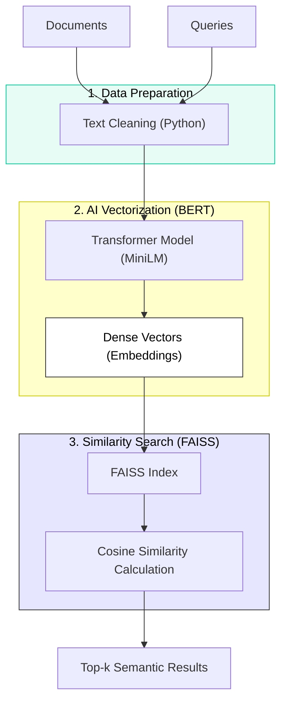
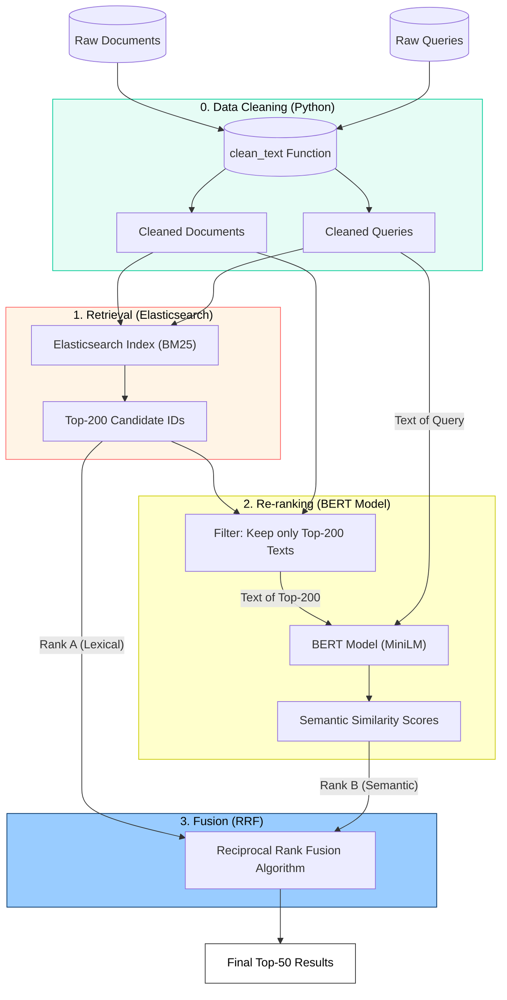

# Information Retrieval System
The system aims to search scientific abstracts from EU Research Projects, utilizing both classical (Lexical) and modern (Semantic) methods.

### Phase 1: Classical Retrieval ([`phase1_elastic.ipynb`](https://github.com/Anthippi/Information-Retrieval-Systems/blob/main/notebooks/phase1_elastic.ipynb))
* **Goal:** Implementation of the Baseline system using Elasticsearch and the BM25 algorithm.
* **Features:**
  * Text Preprocessing (Tokenization, Stemming, Lemmatization, Stopword Removal).
  * Indexing in Elasticsearch.
  * Execution of Boolean queries to optimize Precision/Recall.
  * Result Evaluation (MAP, Precision@k, Recall@k).
 ```mermaid
graph TD
    %% Input
    Docs["Documents"]
    Queries["Queries"]

    %% Process
    subgraph Preprocessing ["Text Processing"]
        Clean["Cleaning & Stemming"]
    end

    subgraph Search_Engine ["Search Engine"]
        Index[("Elasticsearch Index")]
        Algorithm["BM25 Algorithm"]
    end

    %% Output
    Results["Ranked Results"]

    %% Flow
    Docs --> Clean --> Index
    Queries --> Clean --> Algorithm
    Index -.-> Algorithm
    Algorithm --> Results

    %% Styles
    style Preprocessing fill:#e6fcf5,stroke:#0c9,color:#000
    style Search_Engine fill:#fff4e6,stroke:#f66,color:#000
    style Results fill:#e6e6ff,stroke:#333,color:#000
```
### Phase 2: Semantic Retrieval ([`phase2_minilm.ipynb`](https://github.com/Anthippi/Information-Retrieval-Systems/blob/main/notebooks/phase2_minilm.ipynb))
* **Goal:** Implementation of a Dense Retrieval system using Transformers and FAISS.
* **Features:**
  * Utilization of the pre-trained `all-MiniLM-L6-v2` model for generating Embeddings (vectors).
  * Cosine Similarity search in vector space.
  * Evaluation of the model's ability to perceive meaning without exact keywords.

### Phase 3: Hybrid Retrieval ([`phase3_hybrid.ipynb`](https://github.com/Anthippi/Information-Retrieval-Systems/blob/main/notebooks/phase3_hybrid.ipynb))
* **Goal:** Combination of the two previous methods (Hybrid Approach - Retrieve & Re-rank).
* **Features:**
  * Retrieve: Retrieval of top-200 candidate documents from Elasticsearch (for High Recall).
  * Re-rank: Re-ranking of candidates using BERT Embeddings (for High Precision).
  * Fusion: Final merging of rankings using the Reciprocal Rank Fusion (RRF) algorithm.

---
## Prerequisites & Installation
To run the notebooks, you need the following:
* **Python 3.8+**
* **Elasticsearch** (Local installation): Must be running on port `9200`.
* **trec_eval**: The executable file for evaluation (usually placed in a `../../trec_eval/` folder).

### Python Libraries Installation
Run the following command to install the necessary packages:

```Bash
pip install pandas numpy elasticsearch sentence-transformers faiss-cpu nltk scikit 
```
