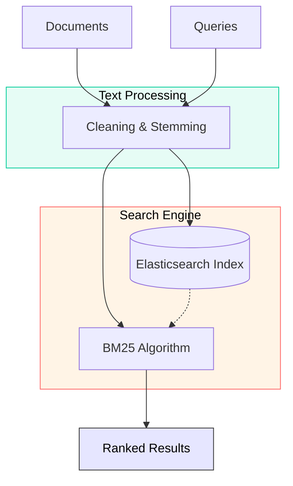
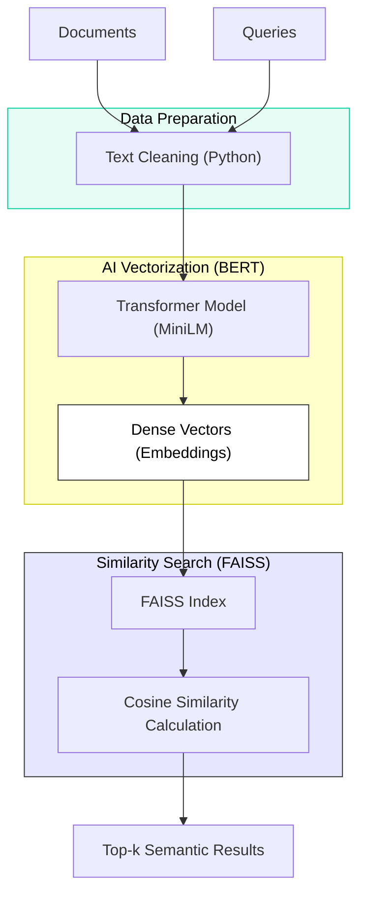
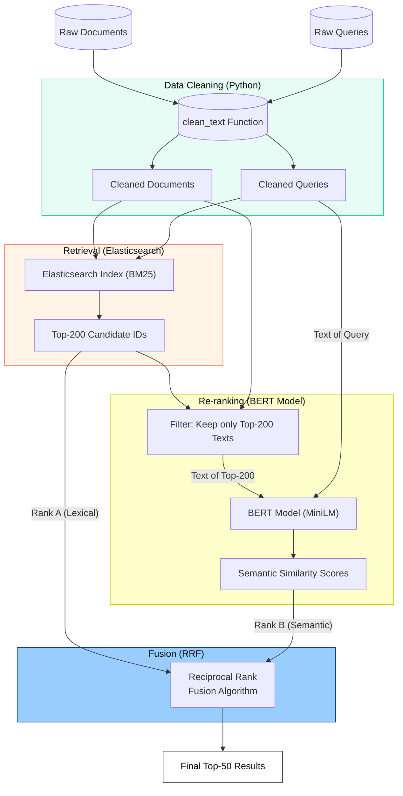

# Σύστημα Ανάκτησης Πληροφοριών. <a name="greek"></a> [](README.en.md)
Το σύστημα στοχεύει στην αναζήτηση επιστημονικών περιλήψεων από Ευρωπαϊκά Ερευνητικά Έργα (EU Research Projects), χρησιμοποιώντας τόσο κλασικές (Lexical) όσο και σύγχρονες (Semantic) μεθόδους.

### Φάση 1: Κλασική Ανάκτηση ([`phase1_elastic.ipynb`](https://github.com/Anthippi/Information-Retrieval-Systems/blob/main/notebooks/phase1_elastic.ipynb))
* **Σκοπός:** Υλοποίηση του Baseline συστήματος χρησιμοποιώντας **Elasticsearch** και τον αλγόριθμο **BM25**.
* **Λειτουργίες:**
    * Προεπεξεργασία κειμένου (Tokenization, Stemming, Lemmatization, Stopword Removal).
    * Δημιουργία ευρετηρίου (Indexing) στο Elasticsearch.
    * Εκτέλεση Boolean ερωτημάτων για βελτιστοποίηση Ακρίβειας/Ανάκλησης.
    * Αξιολόγηση αποτελεσμάτων (MAP, Precision@k, Recall@k).

### Φάση 2: Σημασιολογική Ανάκτηση ([`phase2_minilm.ipynb`](https://github.com/Anthippi/Information-Retrieval-Systems/blob/main/notebooks/phase2_minilm.ipynb))
* **Σκοπός:** Υλοποίηση συστήματος Dense Retrieval χρησιμοποιώντας **Transformers** και **FAISS**.
* **Λειτουργίες:**
    * Χρήση του προ-εκπαιδευμένου μοντέλου `all-MiniLM-L6-v2` για τη δημιουργία Embeddings (διανυσμάτων).
    * Αναζήτηση ομοιότητας συνημιτόνου (Cosine Similarity) σε διανυσματικό χώρο.
    * Αξιολόγηση της ικανότητας του μοντέλου να αντιλαμβάνεται το νόημα χωρίς λέξεις-κλειδιά.

### Φάση 3: Υβριδική Ανάκτηση ([`phase3_hybrid.ipynb`](https://github.com/Anthippi/Information-Retrieval-Systems/blob/main/notebooks/phase3_hybrid.ipynb))
* **Σκοπός:** Συνδυασμός των δύο προηγούμενων μεθόδων (Hybrid Approach - Retrieve & Re-rank).
* **Λειτουργίες:**
    * **Retrieve:** Ανάκτηση των top-200 υποψηφίων εγγράφων από το Elasticsearch (για υψηλό Recall).
    * **Re-rank:** Επανακατάταξη των υποψηφίων με χρήση BERT Embeddings (για υψηλό Precision).
    * **Fusion:** Τελική συγχώνευση των κατατάξεων με τον αλγόριθμο **Reciprocal Rank Fusion (RRF)**.

---

## Προαπαιτούμενα & Εγκατάσταση

Για να εκτελέσετε τα notebooks, χρειάζεστε τα εξής:

* **Python 3.8+**
* **Elasticsearch** (Τοπική εγκατάσταση): Πρέπει να τρέχει στη θύρα `9200`.
* **trec_eval**: Το εκτελέσιμο αρχείο για την αξιολόγηση (συνήθως τοποθετείται σε φάκελο `../../trec_eval/`).

### Εγκατάσταση Βιβλιοθηκών Python
Εκτελέστε την παρακάτω εντολή για να εγκαταστήσετε τα απαραίτητα πακέτα:

```bash
pip install pandas numpy elasticsearch sentence-transformers faiss-cpu nltk scikit-learn matplotlib
